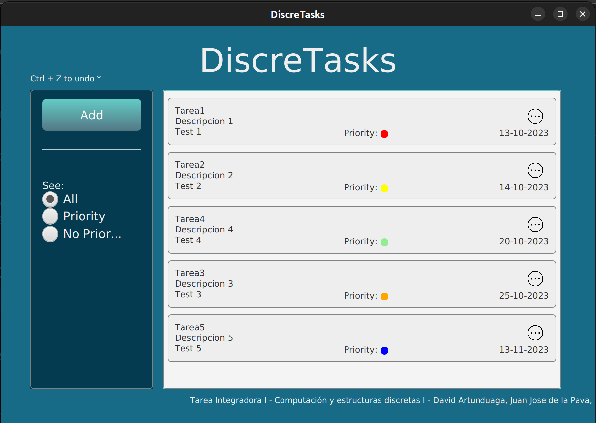

# Discretasks

This project was created as school project for the course "Computación y estructuras discretas" at the University of Icesi, Colombia. 

By: 

-> **Juan José De La Pava - A00381213**

->  **David Artunduaga Penagos - A00396342** 

-> **Rony Farid Ordoñez - A00397968**

The project consists of a CRUD java application for managing Tasks, implementing a UI using JavaFX.

The goal of the project was to implement the following data structures:
- Heap
- HashTable
- Queue
- Stack

to manage the tasks.

### Technologies used

- Java 20 (Logic)
- JavaFX 20 (UI)
- Maven (Dependency management)
- JUnit 5 (Testing)

## Getting Started - How to run it.

1. Clone the repository

    `git clone https://github.com/Rony7v7/DiscreTasks`

2. Open the project in your favorite IDE (IntelliJ, Eclipse, Netbeans, VsCode, etc)

#### How to run it?

Since we are using Maven to manage the dependencies, you will have to run the project using the following command:  

If you have maven installed in your computer: `mvn clean javafx:run`

If you don't have maven installed in your computer: `mvnw clean javafx:run`

     *In some cases to run the maven wraper you will need to run `.\mvnw clean javafx:run`*

**Make sure you are in the root directory of the project where you can access the `pom.xml` file.**

Once you run this commands maven will start downloading the dependencies and then the application will start.

## Documentation:

In the project you will find a folder called `DOCS` where you can find the documentation of the project. Like the UML diagrams, algorithm analysis, or the requierements document.

---

